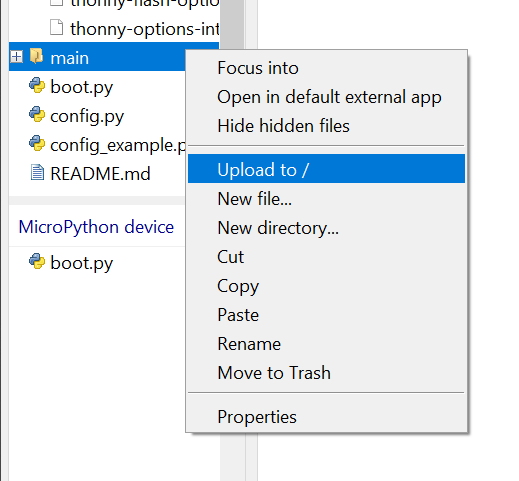

# shorai-esp32

This is a fork of https://github.com/toremick/shorai-esp32/ . 
It provides mqtt control for Toshiba Shorai and Seiya air conditioner.
This fork has a few modifications since the original didn't work for me.

This works great for me, but is at your own risk!

## Software install
* Install thonny (www.thonny.org) on your computer.
* Flash MicroPython on your esp32 using these instructions: https://randomnerdtutorials.com/getting-started-thonny-micropython-python-ide-esp32-esp8266/ , section "Flashing MicroPython Firmware using Thonny IDE". (I used MicroPython v1.23.0.)
  
  
* Open this project in thonny.
* copy config_example.py to config.py and insert your configuration there.
* Click right on the folder main and choose "Upload to /"
  
* Upload config.py and boot.py the same way. (thonny asks you whether you want to overwrite boot.py. Accept with OK.)
* Finally click on the red STOP-icon to reset the esp32.

### PCB Schematic


### PCB Layout

U5 is a jumper, close the jumper to be powered from the heatpump. Remove jumper when powered from usb.

R1: 220R  
R2: 470R  
R3: 10K  
R7,R8,R9,R10: 1K  
U1,U2: 817A (Optocouplers)  
C1: 100uF  
U5: When connected with a Jumper, the pcb is powered from the AC (can be soldered)  

Files for PCB (and possible to order): https://oshwlab.com/toremick/toshiba-ac-heatpump-mqtt  

### Parts list

* 1 x ESP32-DevKitC v4 (38 pins)
* 2 x EL817A Optocoupler (https://www.ebay.com/itm/Straight-Plug-Optocoupler-EL817-A-B-C-D-F-DIP-4-Compatible-PC817-Isolator/253795050804?hash=item3b175d2534:g:LjcAAOSwXVNbY~z3)
* 4 x 0.25w 1K resistors
* 1 x 0.25w 470R resistor
* 1 x 0.25w 10K resistor
* 1 x 0.25w 220R resistor
* 1 x 100uF (11mmx5mm) Capacitor 
* 1 x S05B-PASK-2 (header for connection cable) or 1 x S5B-PH-K-S (header for PH 2.0 connection cable, see below)
* and 2.54mm header pins and sockets

### Connecting the esp to the air conditioner

Unfortunately, Toshiba is using a JST PA connection to connect WIFI support.
The PA type is seldom used.
The PH type is much more used and there are extension cables to buy in case your need one. 


#### (A) Directly connecting to the WIFI adapter cable

First check whether your cable is long enough to be led outside. 
In this case just solder the S05B-PASK-2 on PCB and connect it to the cable.
It should look like this:


toremick has a different model and shared these pictures.
He needed to soldere the capacitor on the solder side laying flat.
This way it fit inside in his AC unit.


#### (B) Using extension cable

I didn't find any precrimped PA extension cables to buy.
If you see some, please let me know, I add a link to them here.
So there are 2 choices, how you can connect your esp:
##### (B1) Crimping your own JST PA extension cable

Here is the extra part list for creating a extension cable:

* JST, PA Female Crimp Connector Housing, 2mm Pitch, 5 Way, 1 Row (https://no.rs-online.com/web/p/wire-housings-plugs/1630360/)
* JST, PA Female Connector Housing, 2mm Pitch, 5 Way, 1 Row (https://no.rs-online.com/web/p/wire-housings-plugs/4766798/)
* JST, PA Female Crimp Connector Housing SPAL-001T-P0.5 (https://no.rs-online.com/web/p/crimp-contacts/1630376/)
* JST, PA, PBV, PHD Female Crimp Terminal Contact 22AWG SPHD-001T-P0.5 (https://no.rs-online.com/web/p/crimp-contacts/6881381/)

##### (B2) Using a PH 2.0 extension cable
I was worried that the metal cover might shield the WIFI from the esp if I go for (B) and connect the esp directly.
But instead of crimping my own JST PA extension cable, I bought 10cm JST PH 2.0 extension cables.

I solederd a S5B-PH-K-S on the pcb instead of the S05B-PASK-2.


The extension cable therfore fits the pcb, but the housing has to be clipped a bit.


Afterwards it can be connected to the air conditioner.


### Open Hab configuration
#### Thing configuration
mqtt.thing
```
Bridge mqtt:broker:mymqtt [ host="xxx", port="xxxx", secure=false, username="xxxx", password="xxxx" ] {
  Thing topic ac-livingroom "air conditioner livingroom" @ "livingroom" {
    Channels:
      Type number : temperature "temperature" [ stateTopic = "ac/livingroom/roomtemp", unit="°C" ]
      Type number : targettemperature "target temperature" [ stateTopic = "ac/livingroom/setpoint/state", commandTopic="ac/livingroom/setpoint/set", unit="°C", step="1" ]
      Type number : outdoortemperature "outdoor temperature" [ stateTopic = "ac/livingroom/outdoortemp", unit="°C" ]
      Type switch : state "state" [ stateTopic = "ac/livingroom/state/state", commandTopic="ac/livingroom/state/set", on="ON", off="OFF" ]
      Type string : mode "mode" [ stateTopic = "ac/livingroom/mode/state", commandTopic="ac/livingroom/mode/set", allowedStates="off,auto,cool,heat,dry,fan_only" ]
      Type string : fan "fan" [ stateTopic = "ac/livingroom/fanmode/state", commandTopic="ac/livingroom/fanmode/set", allowedStates="quiet,lvl_1,lvl_2,lvl_3,lvl_4,lvl_5,auto" ]
      Type switch : swing "fan swing" [ stateTopic = "ac/livingroom/swingmode/state", commandTopic="ac/livingroom/state/set", on="on", off="off" ]
  }
}
```

#### Item configuration
I assume you want to add the items to existing groups livingroom and temperature.
If not remove the "(livingroom, temperature)" from the configuration.

ac.item
```
Number:Temperature AC_Livingroom_Temperature "AC room temperature [%d °C]" <temperature> (livingroom, temperature) { channel="mqtt:topic:mymqtt:ac-livingroom:temperature" }
Number:Temperature AC_Livingroom_Targettemperature "AC target temperature AC [%d °C]" <temperature> (livingroom, temperature) ["Setpoint", "Temperature"] { channel="mqtt:topic:mymqtt:ac-livingroom:targettemperature" }
Number:Temperature AC_Livingroom_Outdoortemperature "AC outdoor temperature [%d °C]" <temperature> (livingroom, temperature) { channel="mqtt:topic:mymqtt:ac-livingroom:outdoortemperature" }
Switch AC_Livingroom_State "AC state " <switch> (livingroom, temperature) { channel="mqtt:topic:mymqtt:ac-livingroom:state" }
String AC_Livingroom_Mode "AC mode" <heating> (livingroom, temperature) { channel="mqtt:topic:mymqtt:ac-livingroom:mode" }
String AC_Livingroom_Fan "AC fan" <wind> (livingroom, temperature) { channel="mqtt:topic:mymqtt:ac-livingroom:fan" }
Switch AC_Livingroom_fan_swing "AC fan swing " <flow> (livingroom, temperature) { channel="mqtt:topic:mymqtt:ac-livingroom:swing" }
Switch AC_Livingroom_switch_by_power_surplus "switch AC whether power surplus" <heating> (livingroom, temperature)
```
#### Rule
In case you have your own (photovoltaic) power plant and have it connected to OpenHab:
Here is a rule that turn the ac on and off depending on whether you have power surplus.
You need to define and set an Integer item housePowerSurplus for this rule, 
which gives the current power surplus (if positive) in W.

ac.rules
```
var Timer tSwitchOn = null
var Boolean switchingOn = false
var Timer tSwitchOff = null
var Boolean switchingOff = false

rule "AC livingroom"
when
  Item housePowerSurplus received update or Item AC_Livingroom_State received update
then
  val Number surplus = (housePowerSurplus.state as QuantityType<Number>)
  if (AC_Livingroom_switch_by_power_surplus.state == ON) {
    if (AC_Livingroom_State.state == OFF ) {
      if ( surplus >= 300 ) {
        if (!switchingOn) {
           switchingOn = true
           tSwitchOn?.cancel()
           tSwitchOn = createTimer(now.plusMinutes(1), [ |
             AC_Livingroom_State.sendCommand(ON)
             switchingOn = false
           ])
         }
      } else {
         tSwitchOn?.cancel()
         switchingOn = false
      }
    }
    if (AC_Livingroom_State.state == ON ) {
      if ( surplus < 0 ) {
        if (!switchingOff) {
           switchingOff = true
           tSwitchOff?.cancel()
           tSwitchOff = createTimer(now.plusMinutes(1), [ |
             AC_Livingroom_State.sendCommand(OFF)
             switchingOff = false
           ])
         }
      } else {
         tSwitchOff?.cancel()
         switchingOff = false
      }
    }
  }
end
```
If you have more than one AC just append a rule for each one in the same rules file.
Since all rules share the same timer- and switching-variables, only one AC will be switched per minute.
This way the rule only turns on that many AC as you have power surplus.


### Home assistant Climate config part (from toremick)

**Important note:**
If you have more than one device, please remember to change the *name*, *unique_id* and all the mqtt strings to have unique names. 
For each device replace the 'ac/livingroom' name with the unique 'maintopic' you have configured in the config.py of your ESP32 device.
Also give each device a separate hostname.

```
mqtt:
  climate:
    - name: HeatPump
      icon: mdi:air-conditioner
      unique_id: toshibaheatpump
      modes:
        - "off"
        - "auto"
        - "cool"
        - "heat"
        - "dry"
        - "fan_only"
      swing_modes:
        - "on"
        - "off"
      fan_modes:
        - "quiet"
        - "lvl_1"
        - "lvl_2"
        - "lvl_3"
        - "lvl_4"
        - "lvl_5"
        - "auto"
      power_command_topic: "ac/livingroom/state/set"
      power_state_topic: "ac/livingroom/state/state"
      mode_command_topic: "ac/livingroom/mode/set"
      mode_state_topic: "ac/livingroom/mode/state"
      current_temperature_topic: "ac/livingroom/roomtemp"
      temperature_command_topic: "ac/livingroom/setpoint/set"
      temperature_state_topic: "ac/livingroom/setpoint/state"
      fan_mode_command_topic: "ac/livingroom/fanmode/set"
      fan_mode_state_topic: "ac/livingroom/fanmode/state"
      swing_mode_command_topic: "ac/livingroom/swingmode/set"
      swing_mode_state_topic: "ac/livingroom/swingmode/state"
      temp_step: 1
      precision: 1
    
```

### Add following to automations.yaml or where you have your automations
(this will query the heatpump for all values so HA will have current state
for everything)

``` 
- id: gethpvalues_on_startup 
  alias: "HP states on HA start-up" 
  trigger:
    platform: homeassistant
    event: start
  action: 
  - service: mqtt.publish 
    data: 
      topic: ac/livingroom/doinit
      payload: startup-ha
    
```


